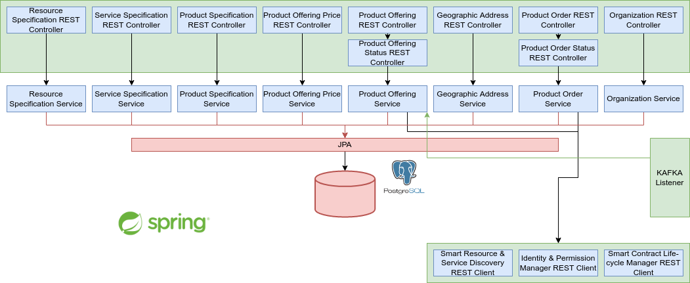

# Resource and Service Offer Catalog

## Introduction
The Resource and Service Offer Catalogue (RSOC) is the module responsible for collecting the 5G assets that are 
available to be traded among providers and customers. This decentralized portfolio enables the process of registering
resources and services, derived from technical specifications, creating, browsing and ordering product offers based on 
on-boarded resource and service assets; this, across multiple parties acting as infrastructure providers, spectrum 
traders, VNF vendors and service providers.</br>


## Prerequisites

### System Requirements
- 1 vCPU
- 2GB RAM

### Software dependencies
- PostgreSQL </br>
  ```bash
  docker run --name some-postgres -p 5432:5432 -e POSTGRES_PASSWORD=postgres -d postgres
  ```
- Apache Kafka </br>
  [Deploy Kafka on docker](https://www.baeldung.com/ops/kafka-docker-setup)
  
If you want to deploy RSOC in a not-virtualized environment you'll need also:

- Java 8 </br>
  ```bash
  sudo apt update
  sudo apt install openjdk-8-jdk
  ```
- Maven </br>
  ```bash
    sudo apt update
    sudo apt install maven
    ```

### 5GZORRO Module dependencies
- [Identity and Permission Manager](https://github.com/5GZORRO/identity)
- [Smart Resource and Service Discovery](https://github.com/5GZORRO/Smart-Resource-and-Service-Discovery-application)
- [Smart Contract Lifecycle Manager](https://github.com/5GZORRO/smart-contract-lifecycle-manager)

## Installation
The following procedures consider the previously listed dependencies already up and running.

### Local Machine

Customize your Offering Catalog properties in 
```resource-and-service-offer-catalog/offering_catalog/src/main/resources/application-local.properties``` 
then from ```resource-and-service-offer-catalog/``` run the following commands.
```bash
export spring_profiles_active=local
mvn clean install
java -jar offering_catalog/target/offering_catalog-1.0-SNAPSHOT.jar
```

### Docker Compose
Customize your Offering Catalog properties in ```resource-and-service-offer-catalog/deployment/.env``` 
then from ```resource-and-service-offer-catalog/``` run the following command.
```bash
docker-compose -f deployment/docker-compose.yaml up -d
```

### Dockerfile
Customize your Offering Catalog properties in ```resource-and-service-offer-catalog/deployment/catalog_dockerfile/env_file``` 
then from ```resource-and-service-offer-catalog/``` run the following command.
```bash
docker build -t offering_catalog -f deployment/catalog_dockerfile/Dockerfile .
```
Run the application from ```resource-and-service-offer-catalog/deployment/catalog_dockerfile/```
```bash
docker run --env-file=env_file offering_catalog:latest
```

### Kubernetes
Customize your Offering Catalog config map in ```resource-and-service-offer-catalog/deployment/catalogue.yaml```
then from ```resource-and-service-offer-catalog/deployment/``` run the following command.
```bash
kubectl apply -f catalogue.yaml
```

## Configuration
No particular configurations are needed.

## Maintainers
**Pietro Giuseppe Giardina** - *Design* - p.giardina@nextworks.it </br>
**Adriana Fernandez** - *Design* - adriana.fernandez@i2cat.net </br>
**Michael De Angelis** - *Develop and Design* - m.deangelis@nextworks.it </br>
**Daniel Bautista Miralles** - *Develop* - daniel.bautista@i2cat.net

## License
This module is distributed under [Apache 2.0 License](LICENSE) terms.